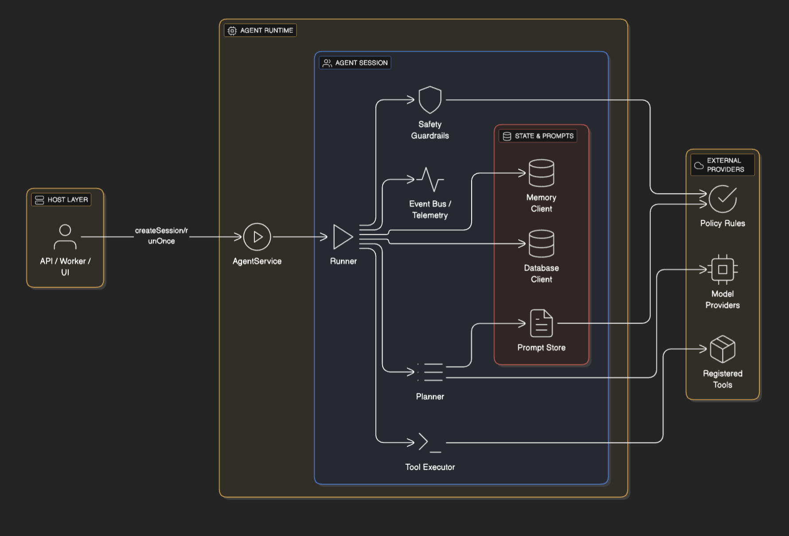
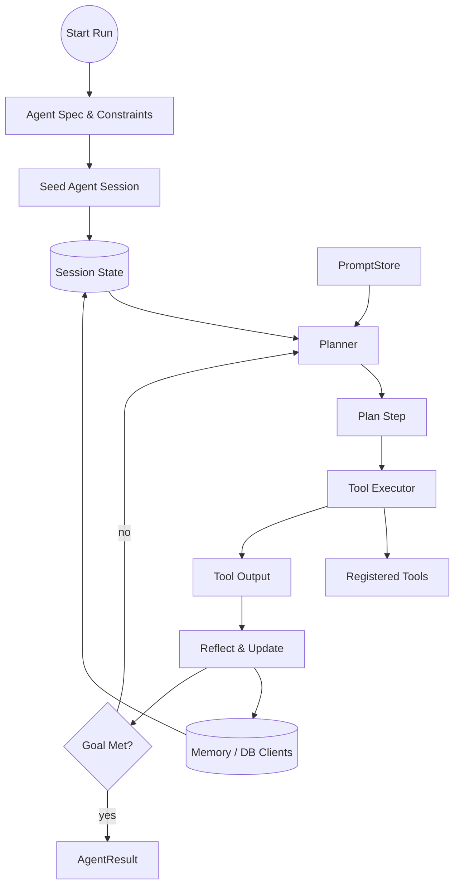
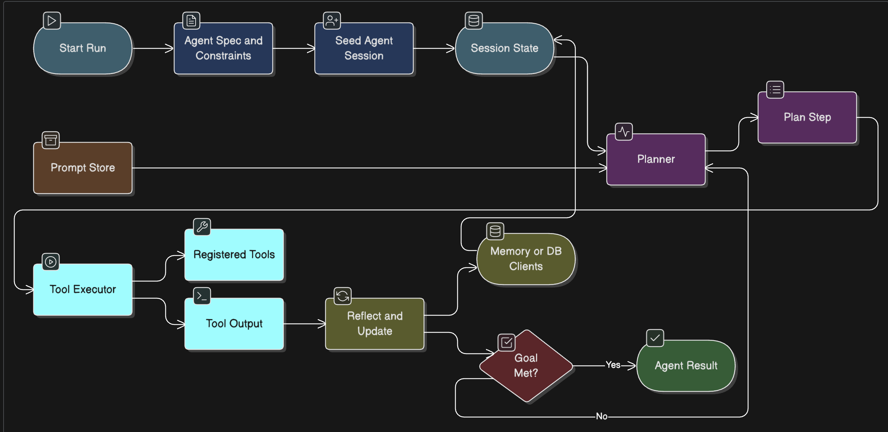

# AI Agent Proposal

## Introduction

The Agent runtime will provide a small-footprint orchestration layer that coordinates model calls, tools, memory, and safety checks to support multi-step autonomous workflows while remaining easy to test and integrate into existing systems.

Goals:
- Provide a clear, minimal API for building and running agents (plan -> act -> reflect loop).
- Make it easy to add tooling (HTTP, SQL, shell, custom functions) with pluggable connectors.
- Support short- and long-term memory primitives with optional persistence clients.
- Offer safety, observability, and deterministic testing hooks.

## Contract

Inputs:
- Agent specification (task prompt, allowed toolset, constraints, memory policy).
- LLM client implementing a simple sync/async call interface (LLMClient).

Outputs:
- Structured action sequence (tool calls, messages) and final result object.

<!-- Error modes moved to todo.md -->

Note: `AgentSession` and `AgentResult` runtime shapes were removed from the design doc to avoid duplication with runtime types. Refer to `src/agents/agent.ts` for the authoritative runtime contract.
		end
	end

	subgraph External Providers
		Tools[Registered Tools]
		ModelProviders[Model Providers]
		PolicyEngine[(Policy Rules)]
	end

	Caller -->|createSession/runOnce| AgentService
	AgentService --> Runner
	Runner --> Planner
	Runner --> ToolExec
	Runner --> Safety
	Runner --> EventBus
	Runner --> MemoryClient
	Runner --> DatabaseClient
	Planner --> PromptStore
	Planner --> ModelProviders
	ToolExec --> Tools
	Safety --> PolicyEngine
	PromptStore --> PolicyEngine
```

</details>



This layered architecture view highlights how the host application interacts with the session-level runtime while keeping external providers (tools, model clients, policy engine) decoupled via narrow contracts. For temporal detail, rely on the textual plan → act → reflect description or runtime traces rather than a full sequence diagram.

### Plan → Act → Reflect loop architecture

The runner coordinates a feedback loop that keeps planning, executing, and reflecting on intermediate results until a termination condition is reached. Each iteration flows through well-defined contracts so hosts can swap implementations without changing the public agent API.

- **Kickoff**: the agent loads the run specification, seeds an `AgentSession`, and hydrates short-term memory from any stored context.
- **Plan**: the planner inspects the latest session state (conversation, scratchpad, memory snapshots) and drafts the next `PlanStep`, often powered by an LLM client and prompt templates.
- **Act**: the tool executor carries out the planned step, invoking registered tools and capturing structured results.
- **Reflect**: the runner merges tool output back into the session state, updates memory/database clients, and decides whether to continue planning or finish the run.

<details>
    <summary>Agent Loop Flow (click to expand)</summary>



</details>



This graph-style diagram highlights the core loop—from kickoff through plan, act, and reflect—while keeping emphasis on the swappable planner, tool executor, and memory components, without introducing separate safety or telemetry layers.

## Core Components


- Agent
	- id: string  # immutable, stable identifier for the agent (slug or UUID)
	- name?: string  # human-friendly label (recommended for UIs)
	- description?: string  # optional long-form Markdown documentation
	- taskPrompt: string
	- tools: ToolDefinition[]
	- memoryClient?: MemoryClient
	- databaseClient?: DatabaseClient
	- promptStore?: PromptStore
	- modelProviders: ModelProvider[]
	- maxSteps?: number

Model provider selection: the default runner should iterate over `modelProviders` in priority order, choosing the first client that advertises support for the requested capabilities (model name, modality, max tokens, cost ceiling). Hosts may supply a custom selection strategy that scores providers by latency/cost or routes specific tasks to specialized models.


- ToolDefinition: small pluggable tool descriptor; see `tools.md` for details.

- LLMClient: provider client for LLMs (sync/async/optional streaming); see `llmclient.md`.

- MemoryClient: short-term ephemeral store for run-local state; see `memory.md` for details.

- DatabaseClient: optional long-term persistent store for knowledge, user profiles, and retrieval-augmented generation (RAG); see `database.md` for details.

PromptStore: see `prompt.md` for template shapes, rendering, and the PromptStore API.

- ExecutionEngine: orchestrates the plan → act → reflect loop for each run; see `execution_engine.md` for the detailed proposal and API contract.

- Agent.run(): Promise<AgentResult>

## Agent Category : OnDemand vs Persistent

Agents come in two broad flavors with slightly different expectations around lifecycle, security, and persistence:

- OnDemandAgent (disposable / prototype)
	- Purpose: quick, short-lived runs for interactive sessions, experimentation, or ephemeral automation tasks.
	- Lifecycle: created per-request or per-interaction, may be kept only in-memory or with short TTLs if persisted.
	- Defaults: conservative by default (no dangerous tools enabled), short timeouts, non-replicated state.
	- Suggested fields: `tempId?: string`, `owner?: string`, `taskPrompt`, `tools` (host may restrict tool set), optional `ttlSeconds` if the host persists short-term state.
	- Use cases: playgrounds, user-driven ad-hoc automations, debugging runs.

- PersistentAgent (registered / long-lived)
	- Purpose: stable, registered agents that represent ongoing automations or services owned by a team.
	- Lifecycle: created once, persisted, versioned by the host, subject to ACLs and lifecycle operations (archive/delete).
	- Defaults: stricter security posture (tool access gated by ACLs or roles), longer execution limits when approved, audit logging enabled.
	- Suggested fields: `id: string`, `owner: string`, `acl?: Record<string,string[]>`, `taskPrompt`, `tools` (explicit whitelist), optional `description` and `name`.
	- Use cases: scheduled automations, production integrations, customer-facing agents.

Design notes:
- Keep `OnDemandAgent` and `PersistentAgent` interfaces small and focused on policy differences rather than implementation details.
- Default to least-privilege for tools; require explicit host approval or RBAC entries to enable sensitive connectors (shell, DB writes, cloud APIs) for PersistentAgents.
- Provide migration paths: hosts should be able to 'promote' an OnDemandAgent to a PersistentAgent after review and enrichment (add owner, acl, persistent storage).

### Scope guidance with memorize-singleton

When using the `innobridge/memorize-singleton` scopes, pair the agent categories with the following lifecycle expectations:

- Persistent agents: decorate with `@Singleton` so they remain globally cached and act as orchestrators or registries.
- On-demand agents: request them with either `@Prototype` (fresh instance per invocation) or `@Request` (cached for the duration of a single async context) depending on how long the run lives.

Spawn patterns:

- **Synchronous runs**: the persistent singleton resolves a new on-demand agent instance directly from the application context, executes `runOnce` (or equivalent), and drops the reference immediately. `@Prototype` scope keeps each run isolated without polluting caches.
- **Asynchronous / long-running runs**: capture the returned promise or job handle before the call returns. Store this handle in a lightweight registry or emit it through an event bus so other components can await completion. Use `@Request` only if the entire workflow stays inside one async context; otherwise prefer `@Prototype` plus an explicit run registry.
- In both cases, avoid storing the on-demand agent itself in global state—persist only identifiers or result promises so the singleton remains stateless and resilient to restarts.

Runtime interface sketch

```ts
interface Agent {
	// create a per-run session/context (opaque implementation-defined handle)
	createSession(opts?: any): any;

	// run the agent: given opts, perform planning and actions (may call tools/LLM/DB)
	// and return the result or throw on fatal errors
	run<T = unknown>(opts?: any): Promise<T>;

	// optional graceful shutdown for long-lived agents
	stop?(): Promise<void>;
}

interface OnDemandAgent extends Agent {
	/**
	 * Temporary/on-demand agents are created for quick runs or interactive prototypes.
	 * They may be stateful and are generally short-lived.
	 */
	// tempId: short-lived correlation id to map a client/request to this ephemeral agent
	// (not a stable identity, not used for authorization; expires quickly)
	tempId?: string;

	owner?: string; // optional user id who created the agent (for short-term access control)
}

interface PersistentAgent extends Agent {
	/**
	 * Persistent agents are registered resources with stable identity and ACLs.
	 */
	id: string; // required stable identifier (slug or UUID)
	owner: string; // owner/team id responsible for this agent
	acl?: Record<string, string[]>; // simple ACL map (role -> permissions)
};
```

These sketches mirror the runtime definitions in `src/agents/agent.ts` and are intentionally minimal; import the concrete types from the runtime file in implementation code when possible.

For a quick sketch of how `Agent.run` hands work to an orchestration layer, see the [Execution Engine sketch](execution_engine.md). It outlines the `ExecutionEngine.execute` signature, the core loop, and the optional hooks for safety, memory, and observability.

### Example agent implementations

| Agent concept | Recommended scope | Rationale | Notes |
| --- | --- | --- | --- |
| ChatAgent | On-demand | Interactive chat sessions are typically user-scoped and short-lived; spinning up a fresh instance per conversation avoids cross-user leakage and lets the host dispose of state once the thread ends. | If conversations need to resume later, persist transcripts separately and hydrate a new agent when the user returns. |
| WorkflowOrchestrator | Persistent | Coordinates scheduled or event-driven automations that must remember owner, schedule, and tool entitlements. A singleton instance per workflow keeps policy and audit data stable. | Pair with ACLs and versioning so operators can roll out updates safely. |
| RetrievalQAAgent | On-demand | Fetches context from knowledge bases to answer ad-hoc queries. Each question can be handled by a disposable agent that seeds short-term memory with query-specific context. | Cache retrieved documents outside the agent if you need cross-request reuse. |
| IncidentTriageAgent | Persistent | Monitors alerts and automatically files tickets or pages responders. Needs long-lived configuration, rotation policies, and tamper-proof audit logs. | Consider a standby on-demand agent for drill runs so production responders remain isolated. |
| DataCleanupAgent | On-demand | Runs batch transformations or validations over datasets. These jobs are usually transient and benefit from fresh per-run parameters. | For large batches, checkpoint progress externally so a new agent can resume after failure. |
| CustomerSupportCopilot | Persistent | Represents a branded assistant with curated tools, tone, and escalation policies. Multiple operators might invoke it, but the configuration should remain centralized and versioned. | Use on-demand child sessions to manage simultaneous conversations while the persistent agent stores shared policy. |


## AgentResult

`AgentResult` is the stable contract returned by `Agent.run()` and `AgentSession.run()`. Keep the base surface minimal so callers can reliably consume it, while exposing optional metadata for observability, replay, and billing.

For the extended shape and helper types see `agent_result.md` (this file contains the detailed field list, helper type sketches, and notes for implementors).

For evaluation and metrics guidance, see `evaluation.md`.

## Agent interface (fundamentals)

We recommend an interface-first design: define a small, stable `Agent` interface as the public contract and provide one or more implementations (e.g., a default service/factory that creates per-run sessions).

Fundamental responsibilities (what an `Agent` must provide):
- Lifecycle: start/stop/health checks and graceful shutdown.
- Execution entry points: create a per-run session and a convenience run-once method.
- Per-run isolation: sessions must encapsulate mutable state (short-term memory, step counters, cancellation tokens).
- Tool management: registration, lookup, and safety metadata for available tools.
- Client access: wire up LLM clients, memory/database clients, prompt stores, and tool connectors.
- Policy & Safety hooks: validate planner outputs and sanitize tool inputs.
- Deterministic testing: support stubbed model clients, seedable RNGs, and in-memory clients.
- Error handling and retries: (moved to todo.md)

Small TypeScript sketch (public surface):

```ts
export interface Agent {
	/** create a per-run session object that holds mutable run state */
	createSession(opts?: RunOptions): any;

	/** convenience: run a single task end-to-end */
	run<T = unknown>(opts?: RunOptions): Promise<T>;

	/** lifecycle */
	stop(): Promise<void>;

	/** events for observability */
	on(event: 'step'|'tool', handler: EventHandler): void;
}

// AgentSession/AgentResult are runtime implementation details; see `src/agents/agent.ts` for the authoritative shapes.
```

Design notes:
- Keep the interface minimal and focused on behaviour (avoid leaking internal types).
- Implementations may expose additional helper APIs but should still implement the `Agent` contract so callers can rely on the interface.
- Prefer composition: provide Planner/Executor/Reflector strategies to implementations rather than forcing subclassing.

## Planner & Execution Interfaces

Keep orchestration components injectable so hosts can swap strategies without modifying the Agent interface. Suggested contracts:

```ts
export interface Planner {
	plan(state: PlannerState): Promise<PlanStep>;
}

export interface PlanStep {
	type: 'tool' | 'message' | 'finish' | 'internal';
	toolId?: string;
	input?: unknown;
	message?: string;
	reason?: string;
}

export interface ToolExecutor {
	execute(step: PlanStep, ctx: ExecutionContext): Promise<ActionResult>;
}

export interface Runner {
	/** Runs the plan-act-reflect loop until completion/abort */
	run(session: AgentSession, spec: AgentSpec): Promise<AgentResult>;
	abort(sessionId: string): Promise<void>;
}
```

`PlannerState` and `ExecutionContext` wrap the mutable per-run session state (conversation transcript, scratchpad, safety budget, memory handles). Keep them slim and free of transport-specific details so planners remain portable.


## Tools and Connectors

Tools should be pluggable and isolated behind small connectors. Provide built-in connectors for:
- HTTP client (fetch wrapper with timeout/retry)
- In-memory KV (for testing)
- SQL (optional, via parameterized queries)
- Shell/Process (careful: default disabled for safety)

Connector contract:
- metadata: id, description, safeByDefault boolean
- run(input): Promise<{ok:boolean, output, meta?}>

Tool registration should support whitelisting/blacklisting per-agent.

## Memory Model

Short-term memory (`MemoryClient`): ephemeral store lives for the duration of a run. Used for step context, scratchpads, and chain-of-thought if enabled.

Memory primitives:
- append(streamKey, entry)
- read(streamKey, opts)
- search(query, opts)

Long-term persistence and production database client guidance moved to `database.md` (see that file for DatabaseClient primitives, privacy, and safety notes).

## Example Flows

## Example Flows

1) Simple info-retrieval agent:
- Task: "Find the latest release notes for project X and summarize changes affecting the API"
- Tools: HTTP fetch, In-memory cache
- Flow: Planner creates HTTP GET -> Executor fetches -> Memory stores -> Planner summarizes -> return summary

2) Multi-step automation:
- Task: "Create a new issue in tracker with a failing test reproduction"
- Tools: repo search, HTTP (issue API), shell (optional test scaffolding)
- Flow: Planner searches repo -> reproduces steps -> runs test script in sandboxed runner -> opens issue via API


## Backwards Compatibility & Integration

Keep the agentsdk surface minimal and provide migration guides. Default behavior: no network or shell access unless explicitly enabled by the host application. Provide clear feature flags and environment configuration options.

## Open Questions / Decisions

- What model providers should we aim to support out of the box? (OpenAI, Anthropic, local LLMs)
- Do we include an opinionated planner or keep the planner as just another model prompt template?
- Persistence choices: prefer SQLite for single-binary deployments vs heavier external deps.

## Security Considerations

- Default deny for potentially destructive tools (shell, DB writes, cloud APIs).
- Provide role-based access controls for tool registration and agent creation.
- Encrypt persisted memory at rest; ensure secrets are never written to logs or persisted stores.

## Appendix: Minimal Example (pseudo-TypeScript)

// ...existing code...

```ts
const agent = new Agent({
	id: 'create-issue',
	taskPrompt: 'Create an issue describing a reproducible test failure',
	tools: [httpTool, kvTool],
	modelProviders: [stubLLMClient],
});

const result = await agent.run();
console.log(result.summary);
```

## Conclusion

This Agent design prioritizes a small, testable core that orchestrates model calls and tool execution with strong safety and observability primitives. It will enable building higher-level autonomous workflows while keeping control and auditability in the host application.


