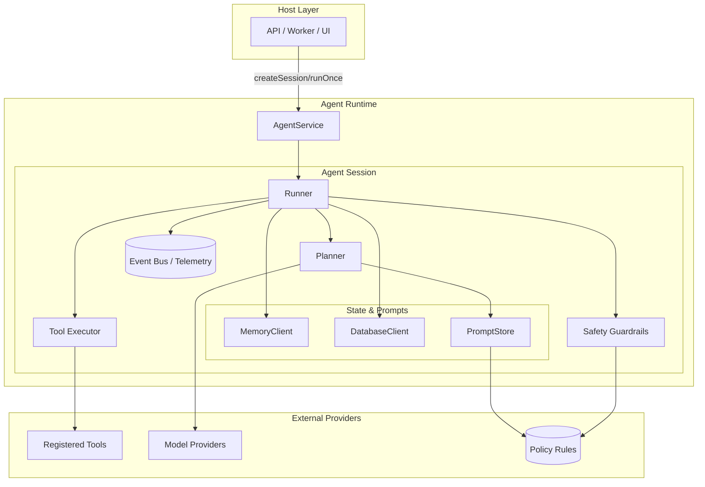
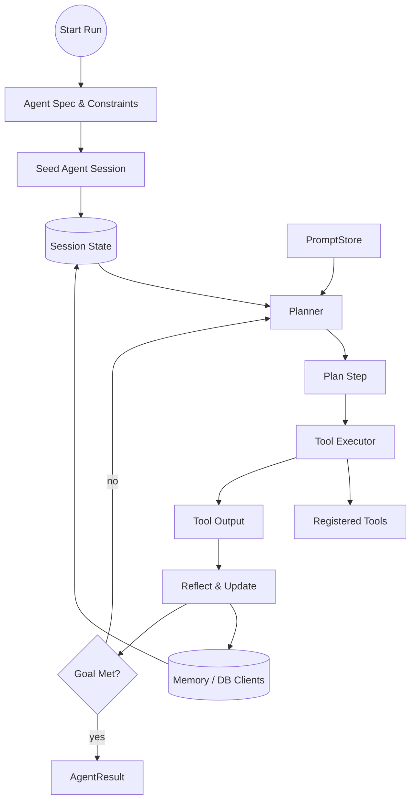

# AI Agent Proposal

## Introduction

The Agent runtime will provide a small-footprint orchestration layer that coordinates model calls, tools, memory, and safety checks to support multi-step autonomous workflows while remaining easy to test and integrate into existing systems.

Goals:
- Provide a clear, minimal API for building and running agents (plan -> act -> reflect loop).
- Make it easy to add tooling (HTTP, SQL, shell, custom functions) with pluggable connectors.
- Support short- and long-term memory primitives with optional persistence clients.
- Offer safety, observability, and deterministic testing hooks.

## Contract

Inputs:
- Agent specification (task prompt, allowed toolset, constraints, memory policy).
- LLM client implementing a simple sync/async call interface (LLMClient).

Outputs:
- Structured action sequence (tool calls, messages) and final result object.
- Rich event stream for observability (step start/end, model tokens, errors).

Error modes:
- Model failures or timeouts.
- Tool errors (retriable vs fatal configurable per tool).
- Safety violations (blocked by policy enforcement layer).

Success criteria:
- Agents can run a multi-step task using at least two tools (e.g., HTTP + in-memory KV) in a single integration test.
- Deterministic replay in tests when using a stubbed model provider and deterministic RNG.

## Architecture Overview

High-level components:
- Runner: orchestrates the plan-act-reflect loop, manages step sequencing and retries.
- Planner: generates next-step instructions (can be a model call or a deterministic planner).
- Executor/Tool Runner: executes actions (tool calls) and returns structured results.
- Memory: short-term (per-run) and long-term (persisted) stores with pluggable clients.
- Connectors: clients or wrappers for LLM providers and tools (HTTP, DB, shell, internal functions).

Sequence (simplified):
1. Agent is constructed with a spec (task, tools, memory policy, limits).
2. Agent invokes Planner to produce a plan for the next action.
3. Agent validates planned actions with Safety layer.
4. Executor runs allowed actions via registered Connectors.
5. Results are written to Memory and fed back to Planner for the next step.
6. Repeat until termination condition (goal reached, steps exhausted, or abort).

## Architecture Diagrams

The platform keeps a slim `AgentService` (singleton) that creates per-run `AgentSession` instances. Each session composes the planner, tool executor, safety checks, memory/database clients, prompt store, and model providers, emitting events that flow to observability sinks.

### Component topology

<details>
    <summary>Component Topology (click to expand)</summary>



</details>


This layered architecture view highlights how the host application interacts with the session-level runtime while keeping external providers (tools, model clients, policy engine) decoupled via narrow contracts. For temporal detail, rely on the textual plan → act → reflect description or runtime traces rather than a full sequence diagram.

### Plan → Act → Reflect loop architecture

The runner coordinates a feedback loop that keeps planning, executing, and reflecting on intermediate results until a termination condition is reached. Each iteration flows through well-defined contracts so hosts can swap implementations without changing the public agent API.

- **Kickoff**: the agent loads the run specification, seeds an `AgentSession`, and hydrates short-term memory from any stored context.
- **Plan**: the planner inspects the latest session state (conversation, scratchpad, memory snapshots) and drafts the next `PlanStep`, often powered by an LLM client and prompt templates.
- **Act**: the tool executor carries out the planned step, invoking registered tools and capturing structured results.
- **Reflect**: the runner merges tool output back into the session state, updates memory/database clients, and decides whether to continue planning or finish the run.

<details>
    <summary>Agent Loop Flow (click to expand)</summary>



</details>


This graph-style diagram highlights the core loop—from kickoff through plan, act, and reflect—while keeping emphasis on the swappable planner, tool executor, and memory components, without introducing separate safety or telemetry layers.

## Core Components


- AgentConfig
	- id: string
	- taskPrompt: string
	- tools: ToolDefinition[]
	- memoryClient?: MemoryClient
	- databaseClient?: DatabaseClient
	- promptStore?: PromptStore
	- modelProviders: ModelProvider[]
	- maxSteps?: number

Model provider selection: the default runner should iterate over `modelProviders` in priority order, choosing the first client that advertises support for the requested capabilities (model name, modality, max tokens, cost ceiling). Hosts may supply a custom selection strategy that scores providers by latency/cost or routes specific tasks to specialized models.

- ToolDefinition
	- id: string
	- schema?: JSONSchema
	- run(input: ToolInput): Promise<ToolOutput>

 - LLMClient
	- call(promptOrMessages: string | ChatMessage[], opts?: CallOptions): Promise<ModelResponse>
	- // optional streaming API: async iterator of token chunks
	- stream?(promptOrMessages: string | ChatMessage[], opts?: StreamOptions): AsyncIterable<TokenChunk>
	- // optional metadata & lifecycle
	- getModelInfo?(): Promise<{ name: string; maxTokens?: number; supportsStreaming?: boolean }>;
	- close?(): Promise<void>;

- MemoryClient
	- append(streamKey, entry): Promise<void>
	- read(streamKey, opts?): Promise<any[]>
	- search?(query, opts?): Promise<any[]>
	- clear?(streamKey): Promise<void>

- DatabaseClient
	- write(collection: string, key: string, value: any): Promise<void>
	- read(collection: string, key: string): Promise<any | null>
	- query(collection: string, q: any, opts?): Promise<any[]>
	- search?(text: string, opts?: { topK?: number }): Promise<any[]>

- PromptStore
	- get(templateId: string, version?: string): Promise<PromptTemplate | null>
	- render(templateId: string, params?: Record<string, any>, opts?: { throwOnMissing?: boolean }): Promise<{ text: string; meta?: { tokensEstimate?: number } }>
	- put(template: Omit<PromptTemplate, 'version'|'createdAt'>, opts?: { author?: string }): Promise<PromptTemplate>
	- list(filter?: { tag?: string; name?: string }): Promise<PromptTemplate[]>
	- validate(templateText: string): Promise<{ ok: boolean; errors?: string[] }>

Prompt templates should be versioned, auditable resources. A minimal shape:

```ts
export interface PromptTemplate {
	id: string;
	version: string;
	name?: string;
	text: string;
	requiredVars?: string[];
	engine?: 'handlebars' | 'liquid' | 'mustache' | 'fstring';
	metadata?: Record<string, unknown>;
	createdBy?: string;
	createdAt?: string;
}
```

The PromptStore is responsible for validating templates (required variables, policy compliance, redaction helpers) before they are rendered and for emitting audit events on changes.

- Agent.run(): Promise<AgentResult>

Eventing hooks (for observability and testing):
- onStepStart(stepInfo)
- onModelTokens(tokens)
- onToolCall(toolId, input)
- onError(err)

## AgentResult

`AgentResult` is the stable contract returned by `Agent.run()` and `AgentSession.run()`. Keep the base surface minimal so callers can reliably consume it, while exposing optional metadata for observability, replay, and billing.

Required fields:
- `id`: unique identifier for the run/result (string)
- `success`: boolean outcome flag
- `result`: final user-facing payload (string or structured object)
- `startedAt` / `finishedAt`: ISO timestamps
- `error`: optional object `{ message, code?, info? }` populated only when `success === false`

Recommended optional fields:
- `sessionId`: per-run session identifier
- `steps`: number of plan/act iterations executed
- `actions`: ordered list of tool/planner steps with inputs/outputs
- `modelCalls`: summary of each LLM invocation (prompt reference, provider, token usage)
- `tokenUsage`, `costEstimate`: usage accounting for billing/monitoring
- `eventStream`: inline events or pointer to persisted trace
- `memoryDeltas`: changes applied to memory/database clients during the run
- `provenance`: template/model references for auditability
- `diagnostics`: warnings, traces, retry metadata, deterministic seed, etc.

TypeScript sketch:

```ts
export interface AgentResult {
	id: string;
	sessionId?: string;
	success: boolean;
	result?: unknown;
	error?: { message: string; code?: string; info?: unknown };
	startedAt: string;
	finishedAt: string;
	steps?: number;
	actions?: ActionResult[];
	modelCalls?: ModelCall[];
	tokenUsage?: TokenUsage;
	costEstimate?: number;
	eventStream?: Event[] | string;
	memoryDeltas?: MemoryChange[];
	provenance?: Provenance;
	diagnostics?: { warnings?: string[]; traces?: string[] };
	aborted?: boolean;
	retryInfo?: { attempts: number; lastError?: string };
	seed?: number;
	deterministic?: boolean;
	metrics?: { durationMs?: number; toolLatencyMs?: Record<string, number> };
	attachments?: Record<string, string>;
}
```

Where helper types (`ActionResult`, `ModelCall`, `TokenUsage`, `MemoryChange`, `Provenance`, `Event`) encapsulate the richer metadata captured by the runner. Implementations may extend the interface but should keep the base fields stable for consumers.

## Agent interface (fundamentals)

We recommend an interface-first design: define a small, stable `Agent` interface as the public contract and provide one or more implementations (e.g., a default service/factory that creates per-run sessions).

Fundamental responsibilities (what an `Agent` must provide):
- Lifecycle: start/stop/health checks and graceful shutdown.
- Execution entry points: create a per-run session and a convenience run-once method.
- Per-run isolation: sessions must encapsulate mutable state (short-term memory, step counters, cancellation tokens).
- Tool management: registration, lookup, and safety metadata for available tools.
- Client access: wire up LLM clients, memory/database clients, prompt stores, and tool connectors.
- Policy & Safety hooks: validate planner outputs and sanitize tool inputs.
- Observability: structured events, traces, and metrics hooks.
- Deterministic testing: support stubbed model clients, seedable RNGs, and in-memory clients.
- Error handling and retries: surface errors, classify retriable vs fatal tool failures, and support configurable retry policies.

Small TypeScript sketch (public surface):

```ts
export interface Agent {
	/** create a per-run session object that holds mutable run state */
	createSession(opts?: RunOptions): AgentSession;

	/** convenience: run a single task end-to-end */
	runOnce(opts?: RunOptions): Promise<AgentResult>;

	/** lifecycle */
	stop(): Promise<void>;

	/** events for observability */
	on(event: 'step'|'tool'|'error'|'metrics', handler: EventHandler): void;
}

export interface AgentSession {
	id: string;
	run(): Promise<AgentResult>;
	abort(): void;
}
```

Design notes:
- Keep the interface minimal and focused on behaviour (avoid leaking internal types).
- Implementations may expose additional helper APIs but should still implement the `Agent` contract so callers can rely on the interface.
- Prefer composition: provide Planner/Executor/Reflector strategies to implementations rather than forcing subclassing.

## Planner & Execution Interfaces

Keep orchestration components injectable so hosts can swap strategies without modifying the Agent interface. Suggested contracts:

```ts
export interface Planner {
	plan(state: PlannerState): Promise<PlanStep>;
}

export interface PlanStep {
	type: 'tool' | 'message' | 'finish' | 'internal';
	toolId?: string;
	input?: unknown;
	message?: string;
	reason?: string;
}

export interface ToolExecutor {
	execute(step: PlanStep, ctx: ExecutionContext): Promise<ActionResult>;
}

export interface Runner {
	/** Runs the plan-act-reflect loop until completion/abort */
	run(session: AgentSession, spec: AgentSpec): Promise<AgentResult>;
	abort(sessionId: string): Promise<void>;
}
```

`PlannerState` and `ExecutionContext` wrap the mutable per-run session state (conversation transcript, scratchpad, safety budget, memory handles). Keep them slim and free of transport-specific details so planners remain portable.


## Tools and Connectors

Tools should be pluggable and isolated behind small connectors. Provide built-in connectors for:
- HTTP client (fetch wrapper with timeout/retry)
- In-memory KV (for testing)
- SQL (optional, via parameterized queries)
- Shell/Process (careful: default disabled for safety)

Connector contract:
- metadata: id, description, safeByDefault boolean
- run(input): Promise<{ok:boolean, output, meta?}>

Tool registration should support whitelisting/blacklisting per-agent.

## Memory Model

Short-term memory (`MemoryClient`): ephemeral store lives for the duration of a run. Used for step context, scratchpads, and chain-of-thought if enabled.

Long-term memory (`DatabaseClient`): optional persistent store for knowledge, user profiles, and retrieval augmented generation (RAG). Provide clients for:
- In-memory (default for tests)
- SQLite (embedded, zero-deps)
- Redis/Postgres (production)

Memory primitives:
- append(streamKey, entry)
- read(streamKey, opts)
- search(query, opts)

Privacy & policy: memory and database clients must support redaction and access controls. The Safety layer must intercept sensitive writes, and prompt/memory writes should run through policy hooks (PII, secrets, retention limits).

## Safety & Policy

Provide an intercepting policy engine with rules configured per-agent. Rules examples:
- toolAllowlist / toolDenylist
- requestRateLimit per-tool
- contentFilter (block prompts or tool inputs that match disallowed categories)

Policy enforcement points:
- Planner output validation (prevent disallowed tool selections)
- Tool input sanitization
- Memory write filters (redact or drop sensitive data)

Audit logs: all blocked/modified actions must be recorded for audit and debugging.

## Observability & Testing

Emit structured events to a pluggable event bus for persisting traces and debugging. Provide a test harness that can:
- Stub model responses deterministically
- Capture the event stream and assert on the sequence of actions
- Run fast integration tests using in-memory clients and connectors

Deterministic mode: allow seeding RNGs and stubbing model tokens to enable snapshot-style tests.

Persist event streams to an append-only store (database client, blob storage, or log aggregator) so production runs can be replayed. Emit redacted logs by default; provide feature flags to include or exclude tool inputs that may contain sensitive data.

## Evaluation & Metrics

Key metrics to capture:
- Task success rate
- Steps per task
- Tool error rates and latencies
- Model token usage and cost estimate

Add unit/integration tests to measure regressions and a lightweight benchmark harness for common scenarios.

## Example Flows

1) Simple info-retrieval agent:
- Task: "Find the latest release notes for project X and summarize changes affecting the API"
- Tools: HTTP fetch, In-memory cache
- Flow: Planner creates HTTP GET -> Executor fetches -> Memory stores -> Planner summarizes -> return summary

2) Multi-step automation:
- Task: "Create a new issue in tracker with a failing test reproduction"
- Tools: repo search, HTTP (issue API), shell (optional test scaffolding)
- Flow: Planner searches repo -> reproduces steps -> runs test script in sandboxed runner -> opens issue via API


## Backwards Compatibility & Integration

Keep the agentsdk surface minimal and provide migration guides. Default behavior: no network or shell access unless explicitly enabled by the host application. Provide clear feature flags and environment configuration options.

## Open Questions / Decisions

- What model providers should we aim to support out of the box? (OpenAI, Anthropic, local LLMs)
- Do we include an opinionated planner or keep the planner as just another model prompt template?
- Persistence choices: prefer SQLite for single-binary deployments vs heavier external deps.

## Security Considerations

- Default deny for potentially destructive tools (shell, DB writes, cloud APIs).
- Provide role-based access controls for tool registration and agent creation.
- Encrypt persisted memory at rest; ensure secrets are never written to logs or persisted stores.

## Appendix: Minimal Example (pseudo-TypeScript)

// ...existing code...

```ts
const agent = new Agent({
	id: 'create-issue',
	taskPrompt: 'Create an issue describing a reproducible test failure',
	tools: [httpTool, kvTool],
	modelProviders: [stubLLMClient],
});

const result = await agent.run();
console.log(result.summary);
```

## Conclusion

This Agent design prioritizes a small, testable core that orchestrates model calls and tool execution with strong safety and observability primitives. It will enable building higher-level autonomous workflows while keeping control and auditability in the host application.


