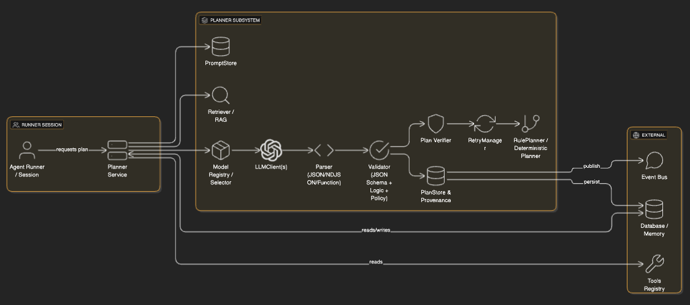

# Planner Design Proposal

This document describes the Planner component for the agentsdk: responsibilities, interfaces, prompting patterns (LLM-backed planners), validation and repair strategies, retry/fallback policies, model selection and reliability tracking, streaming planning, hierarchical planners (HTN), rule-based planners, and operational considerations.

## Goals
- Provide a stable, testable contract for planners used by the Agent runtime.
- Ensure LLM-backed planners produce auditable, machine-parseable plans (JSON/NDJSON/function-calls).
- Define retry/repair/fallback policies for flaky LLMs.
- Support multiple planner flavors (rule-based, LLM, hybrid, HTN, streaming) under a common orchestration model.

## Responsibilities
- Accept a `PlannerState` snapshot (transcript, memory, goal, limits) and propose next actions.
- Produce plans or plan steps in a machine-readable format with provenance metadata.
- Be easily testable in isolation (prefer stateless/pure planners when possible).
- Provide streaming capabilities when interactive intermediate results are required.

## Planner contracts (interfaces)

Promise-based planner (default)

```ts
export type PlanStep = { id: string; type: 'tool'|'message'|'finish'|'internal'; toolId?: string; input?: unknown; meta?: any };

export type Plan = { planId?: string; nodes: Record<string, PlanStep>; edges?: Record<string, string[]> };

export interface PlannerState {
  sessionId: string;
  transcript: Array<{ role: 'user'|'agent'|'tool'; text: string }>;
  memorySnapshot?: unknown;
  goal?: string;
  stepCount: number;
  limits?: { maxSteps?: number; costCeiling?: number };
}

export interface Planner {
  // returns either a single Plan or a PlanStep to execute next
  plan(state: PlannerState): Promise<Plan | PlanStep>;
}
```

Streaming planner (optional)

```ts
export type PlanYield = PlanStep | { partialReasoning: string } | { finish: { result?: unknown } };

export interface StreamingPlanner {
  plan(state: PlannerState): AsyncIterable<PlanYield>;
}
```

Graph/HTN planners

```ts
export type HTNNode = { id: string; kind: 'primitive'|'compound'; primitive?: PlanStep; methods?: string[] };

export interface HTNPlanner {
  initialTask(state: PlannerState): Promise<HTNNode>;
  decompose(node: HTNNode, state: PlannerState): Promise<HTNNode[]>;
}
```

Rule-based planner

```ts
export type Rule = { id: string; match: (state: PlannerState) => boolean; toPlanStep: (state: PlannerState) => PlanStep | null };

export interface RulePlanner {
  plan(state: PlannerState): Promise<Plan | PlanStep>;
  getRules?(): Rule[];
}
```

Normalization helper

Implement a small helper to normalize Promise or AsyncIterable planner results into an AsyncIterable of PlanStep/finish/partial yields so the Runner can handle both transparently.

## LLM-backed planning

LLM planners follow a robust pattern:
1. Compose inputs: state, goal, short context, tool registry, constraints.
2. Retrieve auxiliary context (RAG) if needed and add to the prompt.
3. Render a `PromptTemplate` that instructs the model to return strict JSON (or use function-calling).
4. Call the `LLMClient` (prefer function-calling if supported).
5. Parse, validate (JSON Schema), run logical checks (tool ids, input schemas) and policy checks.
6. On failure: repair/re-prompt a bounded number of times, try alternate models, or fallback to deterministic planner.

### Prompting patterns
- Use a prompt that lists available tool ids and short descriptions.
- Provide a JSON schema example and short examples of valid input/output.
- Instruct the LLM: "Return exactly one valid JSON object and nothing else." or use NDJSON for streaming.

Example minimal prompt (template):

```
You are an autonomous planner. Produce one JSON object matching this schema:
{ "planId": "string", "steps": [ { "id": "s1", "type": "tool", "toolId": "http_fetch", "input": {...} } ] }

Goal: {{goal}}
Context: {{contextSummary}}
Available tools: {{toolList}}
Constraints: maxSteps={{limits.maxSteps}}

Return exactly one valid JSON object and nothing else.
```

## Planner Architecture

This section describes the high-level architecture for the Planner subsystem and how its pieces interact at runtime. The architecture is intentionally modular so hosts can swap LLMs, retrieval clients, verifiers, and fallback planners without changing the runner.

Core components
- PromptStore: versioned templates used to render the planner prompt.
- Retriever: optional RAG component that fetches relevant memory/database documents to include in the prompt.
- ModelRegistry / ModelSelector: metadata and selection policy for choosing which model(s) to call for planning.
- LLMClient(s): provider adapters that call models (supporting call/stream/function-call as available).
- Parser: robust JSON/NDJSON extractor and parser that converts raw LLM output into plan objects.
- Validator: JSON Schema (AJV) + logical checks (tool ids, input schemas) + policy checks.
- Verifier: optional step to rank or validate candidate plans (heuristic or small verifier LLM).
- RetryManager: orchestrates repair retries and model fallbacks according to configured policies.
- FallbackPlanner (RulePlanner): deterministic planner used when LLM plans fail.
- PlanStore / Provenance: persists parsed plans, raw outputs, prompts, model metadata, and validation results for audit and replay.
- Metrics & Telemetry: collect parse/validation/retry/failure counts and per-model reliability metrics.

High-level data flow
1. Runner asks Planner to generate a plan given `PlannerState`.
2. Planner (LLM-backed) invokes Retriever (optional) and renders a prompt via PromptStore.
3. ModelSelector picks a ModelSpec and LLMClient.call/stream is invoked.
4. Parser extracts JSON/NDJSON or function-call outputs and returns structured plan(s).
5. Validator applies schema + logical + policy checks. If valid, persist plan to PlanStore and return to Runner.
6. If invalid, RetryManager attempts small repair prompts or tries a fallback model. If still invalid, FallbackPlanner is used.


<details>
    <summary>Planner Architecture (click to expand)</summary>

```mermaid
graph TB
  %% Component topology (relationships shown with links; not a sequence diagram)
  subgraph Runner/Session
    Runner[Agent Runner / Session]
    PlannerService[Planner Service]
  end

  subgraph PlannerSubsystem
    PromptStore[PromptStore]
    Retriever[Retriever / RAG]
    ModelSelector[Model Registry / Selector]
    LLMClient[LLMClient(s)]
    Parser[Parser (JSON/NDJSON/Function)]
    Validator[Validator (JSON Schema + Logic + Policy)]
    Verifier[Plan Verifier]
    Retry[RetryManager]
    FallbackPlanner[RulePlanner / Deterministic Planner]
    PlanStore[PlanStore & Provenance]
  end

  subgraph External
    Tools[Tools Registry]
    DB[Database / Memory]
    EventBus[(Event Bus)]
  end

  %% Explicit connections showing how components interact
  Runner -->|requests plan| PlannerService
  PlannerService --> PromptStore
  PlannerService --> Retriever
  PlannerService --> ModelSelector
  ModelSelector --> LLMClient
  LLMClient --> Parser
  Parser --> Validator
  Validator --> PlanStore
  Validator --> Verifier
  Verifier --> Retry
  Retry --> FallbackPlanner

  PlannerService -->|reads| Tools
  PlannerService -->|reads/writes| DB
  PlanStore -->|persist| DB
  PlanStore -->|publish| EventBus
```

</details>




Notes:
- The Runner/Session owns execution state and schedules plan execution; PlannerService focuses on producing validated plans and metadata.
- The Parser and Validator are critical for security and reliability — never execute plans before validation.
- ModelSelector and Metrics keep per-model reliability, enabling automated fallback choices.
- The RetryManager implements the repair/retry policy (bounded repair attempts followed by model fallback and final deterministic fallback).

### Parsing and validation
- Extract JSON robustly (extract first JSON block, handle function-call outputs, or parse NDJSON if streaming).
- Validate with AJV (JSON Schema). Also run logical checks: tool ids exist and input matches tool schemas.
- If validation fails, re-prompt once with the model output and an instruction to "fix the JSON".

### Retry, model fallback, verifier
- Retry policy: repairRetries (default 1), modelRetries (default 2). After retries/fallbacks exhausted, call rule-based fallback.
- Optionally generate multiple candidates (n-best) and run a lightweight verifier (heuristics or small verifier LLM) to choose the best candidate.

### Provenance & telemetry
- Persist: prompt template id, rendered prompt (redacted), raw LLM output, parsed plan, model id, temperature, retries performed, parse/validation results.

## Model selection & reliability

- Maintain `ModelSpec` metadata and runtime metrics (parseFailRate, validationFailRate, avgLatency, successRate).
- Prefer models that: support structured outputs/function-calling, have low temperature capability, and have historically low parse/validation failure.
- Use staged approach: low-cost deterministic model for structure, high-capacity model for details.

## Streaming & NDJSON

- For long plans or interactive UIs, ask the model to emit NDJSON lines (one `{"type":"step","step":...}` per line). Persist each step as it arrives and validate line-by-line.

## HTN / Graph / Parallel execution

- Planner can return a DAG/tree. Runner must track per-node statuses and schedule nodes whose dependencies are satisfied.
- Persist node statuses for durability and resume/inspection.

## Fallbacks and safety

- If LLM fails repeatedly, fallback to deterministic `RulePlanner` or present a safe abort.
- Always run policy engine checks before executing any tool step.

## Example: generatePlanWithRetries (pseudocode)

```ts
async function generatePlanWithRetries(state: PlannerState, modelCandidates: ModelSpec[]) {
  // attempt modelCandidates in order, with bounded repair attempts per model
  // parse -> validate -> logical checks -> optional verifier
  // on total failure, return rulePlanner.plan(state)
}
```

## Testing & determinism
- Use stubbed `LLMClient` to simulate parse success/failure for unit tests.
- Record deterministic seeds if planners use RNG.

## Recommended defaults
- Planner should be stateless where possible and return a `Plan` (graph). Runner owns execution state.
- Use Promise-based `Planner` as default; add `StreamingPlanner` support via normalization helper.
- Repair retries: 1; model retries: 2; generate N-best: optional, default off.

## Appendix: example Plan JSON schema (simplified)

```json
{
  "$id": "https://example/plan.schema.json",
  "type": "object",
  "required": ["planId","steps"],
  "properties": {
    "planId": { "type": "string" },
    "steps": {
      "type": "array",
      "items": {
        "type": "object",
        "required": ["id","type"],
        "properties": {
          "id": { "type": "string" },
          "type": { "enum": ["tool","message","finish","internal"] },
          "toolId": { "type": "string" },
          "input": {}
        }
      }
    }
  }
}
```

---

This proposal is intended to be actionable: if you want, I can now implement the `planSchema.json` file, an `llmPlanner.ts` with `generatePlanWithRetries`, a stub `LLMClient`, and a small unit test demonstrating parse-fail -> repair -> fallback behavior. Tell me which set of artifacts you'd like me to add next and I'll scaffold them.
